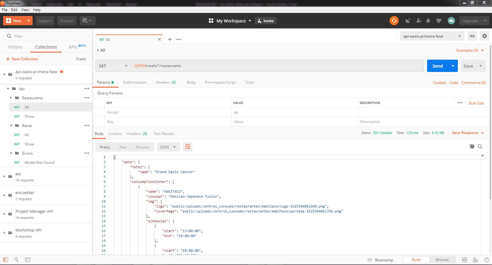

# Api Osasis

## Technical data

```shell

php >= 7.3
Apache: 2.4.41
MariaDB: 10.4.6
XAMPP current version.
```

## Install

```bash
  # Clone repository
  git clone https://github.com/devlegacy/api-oasis-primera-fase.git

  # change directory to api-oasis-primera-fase
  cd ./api-oasis-primera-fase

  # Import/Load database
  mysql -u root -p < ./database/onow_2019-05-24.sql

  # Install dependencies
  composer install

  # Copy .env.example config file to .env
  cp ./.env.example ./.env
```

## Configure .env file

```shell
# .env database example configuration
DB_CONNECTION=mysql
DB_HOST=127.0.0.1
DB_PORT=3306
DB_DATABASE=oasis_primera_fase
DB_USERNAME=root
DB_PASSWORD=
```

## Run project

```bash
  # Run
  php artisan serve
  # Prefer url: http://127.0.0.1:8000
```

## URL Activas

- http://127.0.0.1:8000/api/hotels/1/restaurants
- http://127.0.0.1:8000/api/hotels/1/restaurants/32
- http://127.0.0.1:8000/api/hotels/1/bares
- http://127.0.0.1:8000/api/hotels/1/bares/47
- http://127.0.0.1:8000/api/hotels/4000/restaurants

## Files

Se ha añadido una colección de postman junto a sus variables de entorno para probar las URI's realizadas para la API.

+&nbsp;:open_file_folder: `project-name`

&nbsp;|&nbsp;&nbsp;+-- :open_file_folder: `postman`



## Notes

1. Para esta API decidi usar modelos para realizar las consultas, sin embargo se pudo usar el Query Builder de laravel con la siguiente consulta para obtener los centros de consumo.

  ```sql
    SET @hotel = 1; # Grand Oasis Cancún
    SET @app_lang = 'es'; # Lang
    SET @category = 2; # Restaurant
    # ODBC Standard
    # 1 — Sunday - Domingo
    # 2 — Monday - Lunes
    # 3 — Tuesday - Martes
    # 4 — Wednesday - Miercoles
    # 5 — Thursday - Jueves
    # 6 — Friday - Viernes
    # 7 — Saturday - Sabado

    # Oasis Standar
    # 0 - Lunes
    # 1 - Martes
    # 2 - Miercoles
    # 3 - Jueves
    # 4 - Viernes
    # 5 - Sabado
    # 6 - Domingo
    SET @current_day = CONVERT(
                                (CASE DAYOFWEEK(NOW())
                                    WHEN 2 THEN 0
                                    WHEN 3 THEN 1
                                    WHEN 4 THEN 2
                                    WHEN 5 THEN 3
                                    WHEN 6 THEN 4
                                    WHEN 7 THEN 5
                                    WHEN 1 THEN 6
                                END), CHAR);

    SELECT
            h.nombre AS hotel_name,
            r.nombre AS restaurant_name,
            c.categoria AS category,
            (CASE
                WHEN (@app_lang = 'es') THEN r.concepto_es
                WHEN (@app_lang = 'en') THEN r.concepto_en
            END) AS concept,
            t.dia AS day,
            t.hora_inicio AS start,
            t.hora_final AS end
    FROM hoteles AS h
    INNER JOIN centros_consumo_detalles AS d ON d.hotel_id = h.id
    INNER JOIN centros_consumo AS r ON r.id = d.centro_consumo_id
    INNER JOIN categorias AS c ON c.id = r.categoria_id
    INNER JOIN centros_consumo_horarios AS t ON t.centro_consumo_id = r.id
    WHERE h.id = @hotel AND r.categoria_id = @category AND t.dia = @current_day
    ORDER BY r.id, start ASC
  ```

2. En el caso de la url: /api/hotels/1/restaurants y /api/hotels/1/bares, ya vienen adjuntos los horarios de apertura y cierre del centro de consumo, dependiendo la osicilación de cambio de horarios y que tanto se añade algún horario nuevo, se podría usar la respuestas de estas url y obviar la consulta que nos da los horarios por el id del centro de consumo, ejemplo: /api/hotels/1/restaurants/32

3. En caso de cambiar la URL de la API que genera el comando de artisan al ejecutar el servidor, cambiar la misma en la configuración de ambiente de postman, por defecto se usa: http://127.0.0.1:8000
